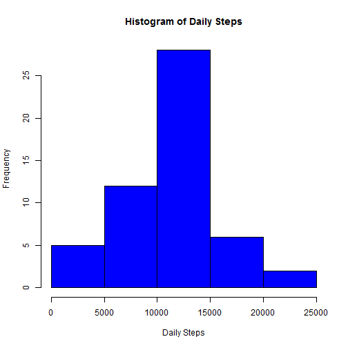
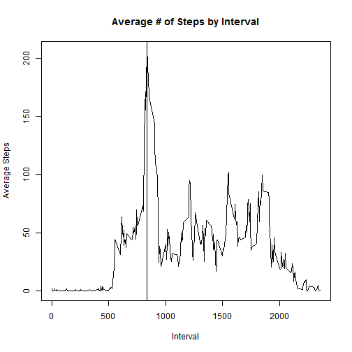
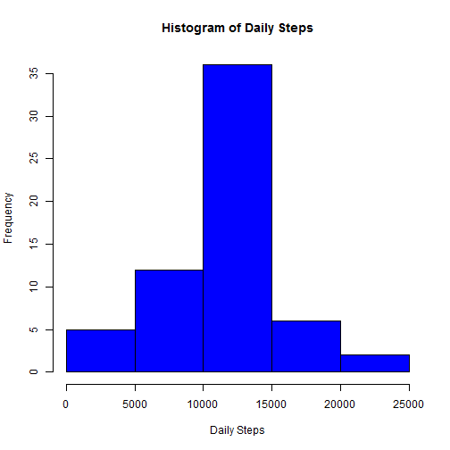
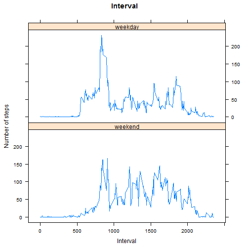

# Reproducible Research: Peer Assessment 1


## Loading and preprocessing the data

```r
setwd("C:\\Users\\ddunn\\Dropbox\\DD Cloud\\Courses\\Coursera - Reproducible Research\\Week 1\\RepData_PeerAssessment1")
d0 <- read.csv("activity.csv",header=TRUE,stringsAsFactors=FALSE)
d1 <- d0
d1$date <- as.Date(d1$date)
```


## What is mean total number of steps taken per day?

```r
dailySteps <- aggregate(steps~date,d1,sum)
h1 <- hist(dailySteps$steps,xlab="Daily Steps",main="Histogram of Daily Steps",col="blue")
```

 

```r
h1
```

```
## $breaks
## [1]     0  5000 10000 15000 20000 25000
## 
## $counts
## [1]  5 12 28  6  2
## 
## $density
## [1] 1.887e-05 4.528e-05 1.057e-04 2.264e-05 7.547e-06
## 
## $mids
## [1]  2500  7500 12500 17500 22500
## 
## $xname
## [1] "dailySteps$steps"
## 
## $equidist
## [1] TRUE
## 
## attr(,"class")
## [1] "histogram"
```

```r
mean(aggregate(steps~date,d1,sum)$steps)
```

```
## [1] 10766
```

```r
median(aggregate(steps~date,d1,sum)$steps)
```

```
## [1] 10765
```

The mean total number of steps daily is 1.0766 &times; 10<sup>4</sup>.
The median total number of steps daily is 10765.


## What is the average daily activity pattern?

```r
intervalSteps <- aggregate(steps~interval,d1,mean)
plot(x=intervalSteps$interval,y=intervalSteps$steps,type="l",xlab="Interval",ylab="Average Steps",main="Average # of Steps by Interval")
maxInterval <- intervalSteps$interval[which(intervalSteps$steps==max(intervalSteps$steps))]
paste(round(maxInterval/5)*5," to ",round(maxInterval/5)*5+5)
```

```
## [1] "835  to  840"
```

```r
abline(v=maxInterval)
```

 

The interval containing the maximum number of average daily steps is 835  to  840.


## Imputing missing values

```r
sum(is.na(d1$steps))
```

```
## [1] 2304
```

```r
d2 <- d1
for(i in d1$interval){
d2$steps[d2$interval==i&is.na(d2$steps)] <- mean(d2$steps[d2$interval==i],na.rm=T)
}

dailySteps2 <- aggregate(steps~date,d2,sum)
h2 <- hist(dailySteps2$steps,xlab="Daily Steps",main="Histogram of Daily Steps",col="blue")
```

 

```r
h2
```

```
## $breaks
## [1]     0  5000 10000 15000 20000 25000
## 
## $counts
## [1]  5 12 36  6  2
## 
## $density
## [1] 1.639e-05 3.934e-05 1.180e-04 1.967e-05 6.557e-06
## 
## $mids
## [1]  2500  7500 12500 17500 22500
## 
## $xname
## [1] "dailySteps2$steps"
## 
## $equidist
## [1] TRUE
## 
## attr(,"class")
## [1] "histogram"
```

```r
mean(aggregate(steps~date,d2,sum)$steps)
```

```
## [1] 10766
```

```r
median(aggregate(steps~date,d2,sum)$steps)
```

```
## [1] 10766
```

```r
hDiff <- data.frame(Breaks=h1$breaks[2:length(h1$breaks)],DensityDiff=h2$density - h1$density)
```
Missing values were imputed by taking the mean number of steps for the missing interval.
Imputing missing values in this manner didn ot materially change the histogram's density.


## Are there differences in activity patterns between weekdays and weekends?

```r
d2$date <- as.POSIXlt(d2$date)
d2$DayType <- weekdays(d2$date)
d2$DayType[d2$DayType %in% c("Sunday","Saturday")] <- "weekend"
d2$DayType[d2$DayType %in% c("Monday","Tuesday","Wednesday","Thursday","Friday")] <- "weekday"
d2$DayType <- ordered(d2$DayType,levels=c("weekend","weekday"))

library(lattice)
```

```
## Warning: package 'lattice' was built under R version 3.0.3
```

```r
intervalStepsDT <- aggregate(steps~interval+DayType,d2,mean)

xyplot(steps~interval|DayType,data=intervalStepsDT,type="l",main="Interval",xlab="Interval",ylab="Number of steps",layout=c(1,2))
```

 
